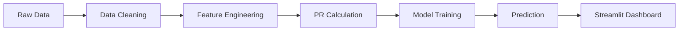

---

# ☀️ Solar Predictive Maintenance System


A **machine learning-powered web application** for monitoring solar plant performance and detecting faults using real-time and historical data.

---

## 🔗 Live Demo

👉 *Add your deployed link here ([Streamlit Cloud / Render](http://localhost:8501/))*

---

## 📌 Problem Statement

Solar plants often suffer from:

* Hidden performance drops
* Late fault detection
* Inefficient monitoring systems

This project solves that by providing:

* 📊 Real-time monitoring
* 🤖 Intelligent predictions
* ⚠️ Early fault detection

---

## 🚀 Features

* ✅ **Performance Ratio (PR) Calculation**
* 🤖 **ML-based Prediction System**
* ⚡ **Live User Input via Streamlit**
* 📉 **Fault Classification (Normal / Warning / Fault)**


---

## 🧠 How It Works



---

## 📊 Performance Ratio (PR)

The **Performance Ratio (PR)** is the core metric used in this project.

* Range: **-1 to 0.3**
* Interpretation:

  * **Normal** → High PR
  * **Warning** → Moderate drop
  * **Fault** → Low / Negative PR

---

## 🤖 Models Used

| Task              | Approach                         |
| ----------------- | -------------------------------- |
| PR Prediction     | Regression Model                 |
| Fault Detection   | Threshold / Classification Model |

---

## 🗂️ Project Structure

```
📁 solar-predictive-maintenance
│
├── 📄 Plant_1_Generation_Data.csv
├── 📄 Plant_1_Weather_Sensor_Data.csv
├── 📄 final_solar_dataset.csv
│
├── 📓 check_data.ipynb
├── 📓 train_model.ipynb
│
├── 🌐 streamlit_app.py
├── 🧠 model.pkl
├── ⚙️ scaler.pkl
│
├── 📦 requirements.txt
└── 📘 README.md
```

---

## ⚙️ Installation

```bash
# Clone repo
git clone https://github.com/your-username/solar-predictive-maintenance.git

# Enter directory
cd solar-predictive-maintenance

# Create virtual environment
python -m venv venv

# Activate environment
# Windows
venv\Scripts\activate

# Install dependencies
pip install -r requirements.txt
```

---

## ▶️ Run Locally

```bash
streamlit run streamlit_app.py
```

Open 👉 [http://localhost:8501](http://localhost:8501)

---

## 📈 Key Results & Insights

* ⚠️ **Fault class recall initially low (0.0)** → highlights class imbalance challenge
* 📊 Improved detection using **threshold-based classification**
* 🔍 PR proved to be a **strong indicator of system health**

---

## 🧩 Challenges

* Imbalanced dataset (fault cases rare)
* Negative PR interpretation
* Multi-class classification complexity

---

## 🔧 Future Improvements

* 🚀 Improve fault detection recall
* 📡 Integrate real-time IoT sensor data
* 🔔 Add alert/notification system

---

## 🛠️ Tech Stack

* **Python**
* **Pandas, NumPy**
* **Scikit-learn**
* **Streamlit**
* **Matplotlib / Seaborn**

---

---

## ⭐ Contribute / Support

If you found this project useful:

* ⭐ Star the repo
* 🍴 Fork it
* 🛠️ Contribute improvements

